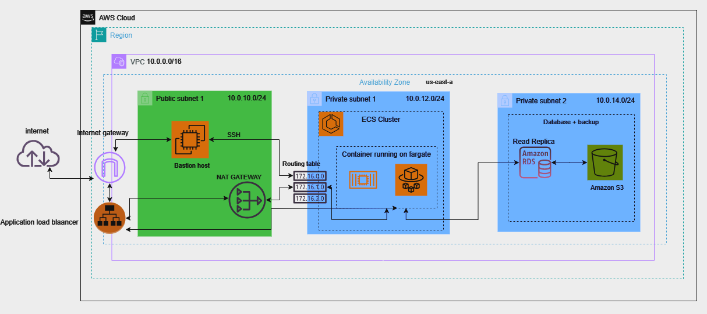

# Multi tier webapp 

In deze README file zullen we uitleggen hoe de infrastructuur van onze applicatie in elkaar zit.  

## Architectuur in AWS

Onze infrastructuur zal bestaan uit drie subnets, één public subnet en twee private subnets. De twee subents dienen voor extra beveiliging te bieden aan onze applicatie + database. Hierdoor is er nooit rechtstreekse toegang naar het internet vanaf deze private subnets. Alles zal dus eerst via de NAT gateway naar buiten/binnen gaan. 



## Overzicht

Dit project is voor de hosting van de data registratie webapplicatie voor het Gladiolen Festival. Het maakt gebruik van een CI/CD-pipeline met GitHub Actions om de workflow te stroomlijnen, specifiek voor het starten van de hostingstructuur in AWS.

## Hoe te gebruiken

### Vereisten

- Een GitHub-account
- Basiskennis van Git
- AWS-account (voor hosting)

### Stap voor Stap

1. **Fork de Repository**:
   - Ga naar de project pagina op GitHub kies de "AWS" repo en klik op de "Fork" knop in de rechterbovenhoek.

2. **Clone je Fork**:
   - Gebruik de volgende Git-opdracht om je geforkte repository te clonen naar je lokale machine:
     ```bash
     git clone https://github.com/DataDumpsters/AWS.git

3. **Navigeren naar de Projectmap**:
   - Ga naar de map waar je het project hebt gekloond:
     ```bash
     cd AWS
     ```
4. **Variabelen Configureren voor AWS**:
   - Het is noodzakelijk om de variabelen van jou AWS omgeving in te stellen binnen github voor de github actions workflow.
   - De variabelen kan je veranderen in de AWS repo in github onder "Settings" > "Secrets and variables" > "Actions".

5. **Pipeline Starten met GitHub Actions**:
   - Voeg je wijzigingen toe en commit ze:
     ```bash
     git add .
     git commit -m "Update configuration variables"
     ```
   - Push je wijzigingen naar je fork:
     ```bash
     git push origin *Naam branch*
     ```
   - De GitHub Actions workflow zal automatisch starten indien je een push doet naar een branch die staat vermeld in de "deploy.yml" op lijn 3 ("branches"). Je kunt de voortgang volgen via de "Actions" tab op GitHub.

### Bijkomende info terraform documenten.

In de "AWS" map kan je verschillende terraform bestanden vinden. Hier kan je naamwijzigingen doen als ook veranderingen maken in de architectuur van AWS. Aangezien dit project niet volledig af is moet dit uiteraard via terraform ook nog verder uitgebouwd worden.

